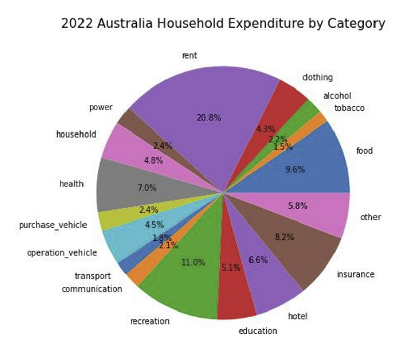
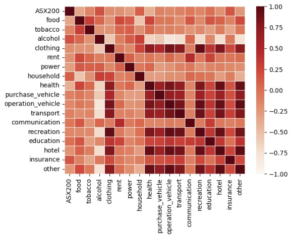

# Australian Household Consumption and Expenditure Pattern: A study from 2012 - 2022
Prepared by Emma H, Kit N, Md Muhasenul H   *7 November 2022*
 

## Introduction
This discovery study seeks to uncover the Australian Household consumption and expenditure pattern. Specifically, we examine:
* Where do Australian spend their money?
* How has the consumption pattern changed over the period from January 2012 to June 2022?
* Is there any relationship between key economic indicators such as unemployment and household saving, and household consumption?
* Is there any relationship between ASX 200 price movements and household consumption?  

We also explore if there is any possbile Covid pandemic stimulated changes in consumption pattern. Extra care has been taken when interpreting the time series analysis results. 

## Data Used
The following data has been used in the study:
* Australian household final consumption and expenditure quarterly seasonally adjusted chain volume measures published by the Australian Bureau of Statistics (ABS)
* Australia monthly seaosonally adjusted unemployment rate published by the ABS
* Australia quarterly seasonally adjusted household saving ratio published by the ABS
* Australian Stock Market Index data collected using the Yahoo Finance API.

Chain volume measure is chosen as it measures consumption volumes by removing the part inflated by price increases. This metric also referred as constant price estimates. It provides better indication of movement in expenditure.

Seasonally adjusted data are used to better reflect the true patterns in the underlying consumption 

### Data Cleaning and Exploration
* Economic related data were sourced from ABS, mainly using panda's read_csv method for consistency. Open API yFinance, which extracted ASX data from Yahoo Finance. Date column is set as index for further concatenation and comparison.

* We first examine the quality of each datasets by checking if there is any missing, null or duplicated value, using the ".isnull.sum()", ".duplicated()" and ".info" method, the result is none, so we conclude the dataset is clean and ready for use.

* The datasets comes in different frequency, some are daily, some are quarterly,  we use parameters, such as "index_col, "dayfirst", "parse_dates" and "infer_datetime_format, " to allow our data frames share consistent date format, and use the method of  ".plot" to visualise trend across the same timeframe of 10 years.

* In the unemployment dataset, basic statistic is run to see how the numbers are distributed, by methods of ".describe", ".max" , "idxmax" and the vice versa 'min', and 'idxmin'. We also use method of ".hvplot", and ""groupby(df.index.year).means()",  to see if particular states are more representative than the other, we decided to use the national data as they share similar pattern.

* When exploring the datasets of household saving and spending, we use method of "pct_change()" to measure its velocity of change over time, and use methods of ".concat() ", ".corr" and "seaborn.heatmap" to visualise correlation among each factors. We observed change of cash rates and household saving only has weak negative coefficient (i.e. -0.18), however rate of unemployment change are strongly corelated to household saving rate change (i.e. +0.76).

* Household spending data are extracted based on chain volume measure to remove the impact of price volatility of consumer goods, we used methods of ".groupby(df.index.year).means() " and ".plot" to visualised the trend of annualised average spending.

* We then convert the annualised averaged into percentage of spending among all the category by combining the transform method and anonymous function (i.e. "transform(lambda x: round(100 * x / df_mean.sum(axis = 1),2))", the converted result was visualised in pie chart used methods of ".subplots".

### Key observations and findings
#### Where do Australian spend their money?

  
In 2022, the top 3 category that Australians spend on are:  
* Rent
* Recreation
* Food

#### How has the consumption pattern changed over time?

We observe year on year increase in household consumption and expenditure from 2012 - 2018. The increase in household spending seem to be plateauing between 2018 and 2019. As the Covid pandemic hits (late Q1 2020), we observe a significant drop in the household expenditure. This is likely driven by the mandatory lockdown and travel restrictions imposed across all states. As we emerge from pandemic, we see a steep increase in household spending.

The following barplot shows the ten year trend for each spending category.

#### Relationship between unemployment and household consumption pattern

**Hypothesis:** As unemployment increases, the expected spending pattern are:
* spending on discretionary items are likely to decrease and
* spending on necessities are likely to remain unchanged.

**Results:** The calculated correlation coefficients between unemployment and spending pattern in each category largely agree with the hypothesis. We observed that spending on tobacco and alcohol tend to increase when unemployment increase. 

#### Relationship between household saving and household consumption pattern

**Hypothesis:** Increase in saving means less spending in absolute dollar terms. The expected spending patterns are:
* spending on discretionary items are likely to decrease and 
* spending on necessities remains largely unchanged.

**Results:** The calculated correlation coefficients between household saving and spending pattern in each category largely agree with the hypothesis. However, an unexpected observation is that there is a positive correlation between saving and spending on alcohol. 

#### Relationship between ASX 200 and household consumption pattern

**Hypothesis:** There is no relationship between ASX 200 returns and household consumption pattern.

**Results:** The calculated correlation coefficients between ASX 200 returns and spending pattern in each category supports the hypothesis.

### Future Development
* There is an obvious decreasing trend in tobacco spending. What are the likely drivers of this decreasing trend?
 
* Enhance the granularity of this study including explore further some of the unexpected observations.

* States and terrorities specific study specifically explore if there is any differences in consumption pattern between states and terrorities.
  
### References
* ABS Household Final Consumption and Expenditure (including household saving): https://www.abs.gov.au/statistics/economy/national-accounts/australian-national-accounts-national-income-expenditure-and-product/latest-release
* ABS Unemployment Rate: https://www.abs.gov.au/statistics/labour/employment-and-unemployment/labour-force-australia/latest-release
* Yahoo Finance API: https://pypi.org/project/yfinance/

