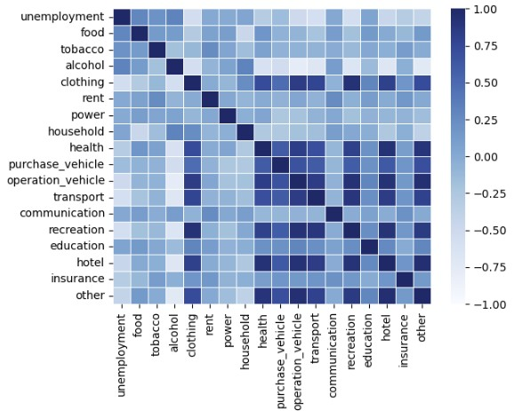

# Australian Household Consumption and Expenditure Pattern: A study from 2012 - 2022
Presented by Emma H, Kit N, Md Muhasenul H   *7 November 2022*
 

## Introduction
This study seeks to uncover the Australian Household consumption and expenditure pattern. Specifically, we examine:
* Where do Australian spend their money?
* How has the consumption pattern changed over the period from January 2012 to June 2022?
* Is there any relationship between key economic indicators such as unemployment rate and household saving ratio and household consumption pattern?
* Is there any relationshp between ASX 200 price movements and household consumption pattern?  

We also explore if there is any possbile Covid pandemic stimulated changes in consumption pattern. Care should be taken when interpreting the time series analysis results. 

## Data Used
The following data has been used in the study:
* Australian household final consumption and expenditure quarterly seasonally adjusted chain volume measures published by the Australian Bureau of Statistics (ABS)
* Australia monthly seaosonally adjusted unemployment rate published by the ABS
* Australia quarterly seasonally adjusted household saving ratio published by the ABS
* Australia Stock Market Index data collected using the Yahoo Finance API.

### Data Cleaning and Exploration
#### Household consumption and expenditure data

TBC - Emma to add

#### Economic Data
* To explore economic data based on info published in ABS and cash interest rate from RBA, mainly using panda's read_csv method for consistency.
* We first examine the quality for each our subject datasets by checking if there is missing value or null value, using the ".isnull.sum()" and ".info" method, the result is none, so we conclude the dataset is clean and ready for use.
* After reading the dataset into dataframe, basic statistic is run in order to see how the numbers are distributed, by method of ".describe", ".max" , "idxmax" and the vice versa 'min', and 'idxmin'.
* Apart from plotting the daily available data in line chart to its pattern to surface, we also use the method of "pct_change()" in order to see the velocity of the change.
* We also explore the means of each year of the unemployment rate used the combination of .groupby(df.index.year).mean(), and found no significant outlier for each states in the past ten years, we observed that the states of TAS and SA often has the highest unemployment rate, whereas ACT has the lowest unemployment.

### Key observations and findings
#### Where do Australian spend their money?

#### How has the consumption pattern changed over time?

* There is year on year increase in household consumption and expenditure from 2012 - 2018.
* The increase in household spending seem to be plateauing between 2018 and 2019.
* As the Covid pandemic hits (late Q1 2020), we observe a significant drop in the household expenditure. This could primarily attributable to the mandatory lockdown and travel restrictions imposed across all states. 

2. We have discovered that the spending of people has pretty much remained same expect some significant canges in the areas of a. telecommunicaiton, b. tobacco consumtion and c. transportation 

#### Relationship between unemployment and household consumption

3. Unemployement is negetively correlated with the changes in spending in clothing (0.547129) and transport (0.580948) recretion (0.555207). There is a slightly positive correlation with alcohol (0.325923). 

#### Relationship between household saving and household consumption

4. Saving is positively correlated with alcohol spending (0.766694) and negatively correlated with operation_vehicle (0.873177, recreation 0.791215, hotel 0.799859. 

### Possible use of Data 
Looking at the changes in data we can come up with a possible assumption that people are travelling less due to work from home arrangement. 

Spending in telecommunicaiton has increased due to advance work from home set up is causing people to spend more on telecoomunication for connectivity from home. 

Pople are more health concern since there is a significant drop in tobaco consumption and additional spending on health. 

If any business wants to invest their money they can work on investing in telecommunication, health related products. 

Car importers may need to think differently for introducing vehicles supporting recreation more than day to day transport. 

### Future Development

What are the ares of telecoomunication people are spending and whether there is any scope of fintech companies to play role in that areas. 

### References

https://pypi.org/project/yfinance/

